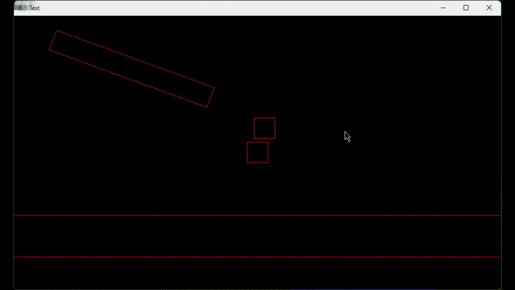

# PhysicEngine-Capolavolro-

Una libreria per la simulazione di un mondo fisico.

## Funzionalità

- Simulazione di oggetti rettangolari ruotabili
- Simulazione della gravitá
- Rilevamento delle collisioni
- Risposta alle collisioni realistica

---

## Demo Video

